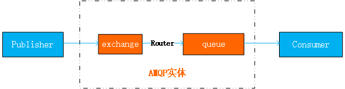

9.1 浅谈AMQP协议
=============================

AMQP的定义
>>>>>>>>>>>>>>>>

AMQP（Advanced Message Queuing Protocol高级消息队列协议）是一个网络协议。
他支持客户端应用（消费者或生产者Application）和消息中间件代理之间的通信。此外，
AMQP协议是一个二进制协议，拥有一些现代特点：多信道、协商式、异步、安全、跨平台、中立、高效。

AMQP通常被划分为三层：

* 模型层定义了一套命令（按功能分类），客户端应用可以利用这些命令来实现它的业务功能。
* 会话层负责将命令从客户端应用传递给服务器，再将服务器的应答传递给客户端应用，会话层为这个传递过程提供可靠性、同步机制和错误处理。
* 传输层提供帧处理、信道复用、错误检测和数据表示。

消息代理主要有两项职责：

* 从发布者Publisher(生产者Application)获取消息。
* 根据既定的路由规则将消息发送给处理消息的消费者Consumer。

由于AMQP模型描述了一套模块化的组件以及这些组件之间进行连接的标准规则，所以消费者Application、生产者Application、
AMPQ代理(AMQP实体)可部署于不同设备上。前提是前述三大组件保持这些语义的一致性，否则就无法进行互操作。

AMQP 0-9-1模型
>>>>>>>>>>>>>>>>>

消息（message）被发布者（publisher）发送给交换机（exchange），交换机常常被比喻成邮局或者邮箱。
然后交换机将收到的消息根据路由规则分发给绑定的队列（queue）。
最后AMQP代理（AMQP实体）会将消息投递给订阅了此队列的消费者，或者消费者按照需求自行获取。

AMQP是一个可编程的协议
>>>>>>>>>>>>>>>>>>>>>>

AMQP 0-9-1是一个可编程协议，某种意义上说AMQP的实体及其路由规则均是由应用本身定义的，而不是由消息代理定义
。包括像声明队列和交换机，定义他们之间的绑定，订阅队列等等协议本身的操作。

这虽然让开发人员自由发挥，但也需要他们注意潜在的定义冲突。当然这在实践中很少会发生，如果发生，会以配置错误的形式表现出来

应用程序（Application）声明AMQP实体，定义需要的路由方案，或者删除不再需要的AMQP实体。

交换机及交换机类型
>>>>>>>>>>>>>>>>>>>>>>>>

交换机是用来发送消息的AMQP实体。交换机拿到一个消息之后将他路由给0个或1个队列。它使用哪种路由算法是
由交换机类型和被称为绑定（bindings）的规则所决定的。AMQP 0-9-1 的代理提供了四种交换机

============================ =======================================
交换机类型                    预声明的默认名称
============================ =======================================
Direct exchange（直连交换机   (Empty string) and amp.direct
Fanout exchange（扇形交换机   amp.fanout
Topic exchange（主题交换机）  amp.topic
Headers exchange（头交换机    amp.match(and amp.headers in RabbitMQ)
============================ =======================================

除了交换机类型外，在声明交换机时还可以附带许多其他属性，其中最重要的几个分别是：

* Name
* Durability（消息代理重启后，交换机是否还存在）
* Auto-delete（当所有与之绑定的消息队列都完成了对此交换机的使用后，删除它）
* Arguments（依赖代理本身）

交换机可以有两个状态：持久（durable）、暂存（transient）。持久化的交换机会在消息代理（broker）
重启后依然存在，而暂存的交换机则不会（他们需要在代理再次上线后重新被声明）。然后并不是所有的应用场景都需要持久化
化的交换机

默认交换机
>>>>>>>>>>>>>>
默认交换机（default exchange）实际上是一个右消息代理预先声明好的没有名字（名字为空字符串）的
直连交换机（direct exchange）。它有一个特殊的属性使得他对于简单应用特别有用处：那就是每个新建队列
（queue）都会自动绑定到默认交换机上，绑定的路由键（routing key)名称与队列名称相同。

AMQP协议 术语
>>>>>>>>>>>>>>>>>>>>>>>>

* **AMQP模型（AMQP Model）：** 一个由关键实体和语义表示的逻辑框架，遵从AMQP规范的服务器必须提供这些实体和语义。为了实现本规范中定义的语义，客户端可以发送命令来控制AMQP服务器。
* **连接（Connection）：** 一个网络连接，比如TCP/IP套接字连接。
* **会话（Session）：** 端点之间的命名对话。在一个会话上下文中，保证“恰好传递一次”。
* **信道（Channel）：** 多路复用连接中的一条独立的双向数据流通道。为会话提供物理传输介质。
* **客户端（Client）：** AMQP连接或者会话的发起者。AMQP是非对称的，客户端生产和消费消息，服务器存储和路由这些消息。
* **服务器（Server）：** 接受客户端连接，实现AMQP消息队列和路由功能的进程。也称为“消息代理”。
* **端点（Peer）：** AMQP对话的任意一方。一个AMQP连接包括两个端点（一个是客户端，一个是服务器）。
* **搭档（Partner）：** 当描述两个端点之间的交互过程时，使用术语“搭档”来表示“另一个”端点的简记法。比如我们定义端点A和端点B，当它们进行通信时，端点B是端点A的搭档，端点A是端点B的搭档。
* **片段集（Assembly）：** 段的有序集合，形成一个逻辑工作单元。
* **段（Segment）：** 帧的有序集合，形成片段集中一个完整子单元。
* **帧（Frame）：** AMQP传输的一个原子单元。一个帧是一个段中的任意分片。
* **控制（Control）：** 单向指令，AMQP规范假设这些指令的传输是不可靠的。
* **命令（Command）：** 需要确认的指令，AMQP规范规定这些指令的传输是可靠的。
* **异常（Exception）：** 在执行一个或者多个命令时可能发生的错误状态。
* **类（Class）：** 一批用来描述某种特定功能的AMQP命令或者控制。
* **消息头（Header）：** 描述消息数据属性的一种特殊段。
* **消息体（Body）：** 包含应用程序数据的一种特殊段。消息体段对于服务器来说完全透明——服务器不能查看或者修改消息体。
* **消息内容（Content）：** 包含在消息体段中的的消息数据。
* **交换器（Exchange）：** 服务器中的实体，用来接收生产者发送的消息并将这些消息路由给服务器中的队列。
* **交换器类型（Exchange Type）：** 基于不同路由语义的交换器类。
* **消息队列（Message Queue）：** 一个命名实体，用来保存消息直到发送给消费者。
* **绑定器（Binding）：** 消息队列和交换器之间的关联。
* **绑定器关键字（Binding Key）：** 绑定的名称。一些交换器类型可能使用这个名称作为定义绑定器路由行为的模式。
* **路由关键字（Routing Key）：** 一个消息头，交换器可以用这个消息头决定如何路由某条消息。
* **持久存储（Durable）：** 一种服务器资源，当服务器重启时，保存的消息数据不会丢失。
* **临时存储（Transient）：** 一种服务器资源，当服务器重启时，保存的消息数据会丢失。
* **持久化（Persistent）：** 服务器将消息保存在可靠磁盘存储中，当服务器重启时，消息不会丢失。
* **非持久化（Non-Persistent）：** 服务器将消息保存在内存中，当服务器重启时，消息可能丢失。
* **消费者（Consumer）：** 一个从消息队列中请求消息的客户端应用程序。
* **生产者（Producer）：** 一个向交换器发布消息的客户端应用程序。
* **虚拟主机（Virtual Host）：** 一批交换器、消息队列和相关对象。虚拟主机是共享相同的身份认证和加密环境的独立服务器域。客户端应用程序在登录到服务器之后，可以选择一个虚拟主机。

