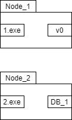
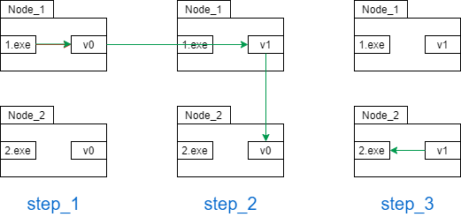

11.3 分布式设计之CAP理论
==============================

/* 部分参考自 https://blog.csdn.net/yeyazhishang/article/details/80758354

随着Web应用的发展，渐渐地抛弃了传统“一体机”的开发模式，取而代之的是将原有的整体业务\
模型进行适当拆分（也就是将一个人做的事情分给了N个人来做，但效果是一个人做的效果），这也就是分布式系统设计，
但分布式系统的设计存在一个\
最大的难点，那就是数据一致性问题（受网络信道、流量拥塞等等影响），而CAP理论正是在处理这类问题时，必须\
用以参考的理论

**什么是CAP理论？**

* C： Consistency（一致性）
* A： Availability（可用性）
* P： Partition tolerance（分区容错性）

在CAP理论中，一致性、可用性、分区容忍性是分布式系统的三大指标，但一个分布式系统不可能同时满足这三点
，最多较好地满足其中两个

============== ====
CA(without P)  如果不要求P（不允许分区），则C（强一致性）和A（可用性）是可以保证的。但放弃P的同时也就意味着放弃了系统的扩展性，也就是分布式节点受限，没办法部署子节点，这是违背分布式系统设计的初衷的。
CP(without A)  如果不要求A（可用），相当于每个请求都需要在服务器之间保持强一致，而P（分区）会导致同步时间无限延长(也就是等待数据同步完才能正常访问服务)，一旦发生网络故障或者消息丢失等情况，就要牺牲用户的体验，等待所有数据全部一致了之后再让用户访问系统。设计成CP的系统其实不少，最典型的就是分布式数据库，如Redis、HBase等。对于这些分布式数据库来说，数据的一致性是最基本的要求，因为如果连这个标准都达不到，那么直接采用关系型数据库就好，没必要再浪费资源来部署分布式数据库。
AP(wihtout C)  要高可用并允许分区，则需放弃一致性。一旦分区发生，节点之间可能会失去联系，为了高可用，每个节点只能用本地数据提供服务，而这样会导致全局数据的不一致性。典型的应用就如某米的抢购手机场景，可能前几秒你浏览商品的时候页面提示是有库存的，当你选择完商品准备下单的时候，系统提示你下单失败，商品已售完。这其实就是先在 A（可用性）方面保证系统可以正常的服务，然后在数据的一致性方面做了些牺牲，虽然多少会影响一些用户体验，但也不至于造成用户购物流程的严重阻塞。
============== ====

**三大指标的介绍**

假设某一个分布式系统有两个网络节点Node_1, Node_2，这两个节点上分别运行了相同的应用服务1.exe和2.exe \
，并且分别存储着子数据库节点DB_1和DB_2，如下图所示：

假设两个用户A，B此时同时访问了两个站点的服务，且A更新了DB_1的数据（将旧数据v0改成了v1）那么在理想情况下，要保证CAP三要素的话，可能 \
其逻辑图如下：

**证明为什么不能同时满足CAP**

